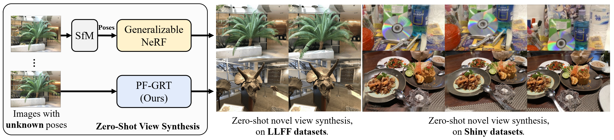

<div align="center">

<h1>Pose-Free Generalizable Rendering Transformer</h1>


## [Paper:[](https://arxiv.org/abs/2310.03704)] | [Website: [](https://zhiwenfan.github.io/PF-GRT)] | [Video: [](https://youtu.be/EfDOuVa5A2A)]


<!-- <div>
        <a href="https://zhiwenfan.github.io/">Zhiwen Fan</a><strong><sup>1,*</sup></strong>,
        <a href="https://paulpanwang.github.io/">Panwang Pan</a><strong><sup>2,*</sup></strong>,
        <a href="https://peihaowang.github.io/">Peihao Wang</a><strong><sup>1</sup></strong>,
        <a href="https://yifanjiang19.github.io/">Yifan Jiang</a><strong><sup>1</sup></strong>, <br>
        <a href="https://hwjiang1510.github.io/">Hanwen Jiang</a><strong><sup>1</sup></strong>, 
        <a href="https://ir1d.github.io/">Dejia Xu</a><strong><sup>1</sup></strong>,
        <a href="https://wdilin.github.io/">Dilin Wang</a><strong><sup>3</sup></strong>,
        <a href="https://vita-group.github.io/">Zhangyang Wang</a><strong><sup>1</sup></strong>
</div> -->
<!-- <div>
    <sup>1</sup>The University of Texas at Austin &emsp;
    <sup>2</sup>ByteDance &emsp; 
    <sup>3</sup>Meta &emsp; 
         <sup>*</sup>denotes equal contribution
</div> -->



<strong> Pose-Free framework for Generalizable Rendering Transformer(FP-GTR) eliminates the need for pre-computed camera poses and is able to render novel views in a feed-forward pass under unseen scenes.</strong>

<!-- --- -->


</div>


## Updates
- [ ] Novel-view synthesis on custom scene.
- [x] Training and evaluation codes on PF-GTR are released.


##  Data Preparation
### 1. Download the [IBRNet's](https://github.com/googleinterns/IBRNet) dataset from the official website.
```bash
cd data/

# IBRNet captures
gdown https://drive.google.com/uc?id=1rkzl3ecL3H0Xxf5WTyc2Swv30RIyr1R_
unzip ibrnet_collected.zip

# LLFF
gdown https://drive.google.com/uc?id=1ThgjloNt58ZdnEuiCeRf9tATJ-HI0b01
unzip real_iconic_noface.zip

## [IMPORTANT] remove scenes that appear in the test set
cd real_iconic_noface/
rm -rf data2_fernvlsb data2_hugetrike data2_trexsanta data3_orchid data5_leafscene data5_lotr data5_redflower
cd ../

# Spaces dataset
git clone https://github.com/augmentedperception/spaces_dataset

# RealEstate 10k
## make sure to install ffmpeg - sudo apt-get install ffmpeg
git clone https://github.com/qianqianwang68/RealEstate10K_Downloader
cd RealEstate10K_Downloader
python3 generate_dataset.py train
cd ../

# Google Scanned Objects
gdown https://drive.google.com/uc?id=1w1Cs0yztH6kE3JIz7mdggvPGCwIKkVi2
unzip google_scanned_objects_renderings.zip

# Blender dataset
gdown https://drive.google.com/uc?id=18JxhpWD-4ZmuFKLzKlAw-w5PpzZxXOcG
unzip nerf_synthetic.zip

# LLFF dataset (eval)
gdown https://drive.google.com/uc?id=16VnMcF1KJYxN9QId6TClMsZRahHNMW5g
unzip nerf_llff_data.zip
```

### 2. Unzip files and organize the data as follows:
```bash
${ROOT} 
├──📂data/
    ├──📂ibrnet_collected_1/
       ├── 📂...
       ├── 📜...
    ├──📂ibrnet_collected_2/
    ├──📂real_iconic_noface/
    ├──📂spaces_dataset/
    ├──📂RealEstate10K-subset/
    ├──📂google_scanned_objects/
    ├──📂nerf_synthetic/
    ├──📂nerf_llff_data/
```

### Installation
The code is tested with python 3.9, cuda == 11.3, pytorch == 1.10.1. Additionally dependencies include: 

```bash
torchvision
ConfigArgParse
imageio
matplotlib
numpy
opencv_contrib_python
Pillow
scipy
imageio-ffmpeg
lpips
scikit-image
loguru
```
Setup with Conda:
```bash
conda create -n pfgrt python=3.9
pip3 install torch==1.10.1+cu113 torchvision==0.11.2+cu113 torchaudio==0.10.1 -f https://download.pytorch.org/whl/torch_stable.html
pip3 install -r ./requirements.txt
```


##  Usage
### 1. Run `./train.py` 

```bash
# python3 train.py --config <config> --optional[other kwargs]. Example:
python3 train.py --config configs/view_selector.yaml 


# python3 train.py --config <config> --optional[other kwargs]. Example:
python3 train.py --config configs/pose_free_transfomer.yaml 
```

### 2. Run `./eval.py` 
```bash

# python3 eval.py --run_val --N_samples 192 --config <config> --optional[other kwargs]. Example:

# single scene in specified dataset (such as llff)
python3 eval.py --config configs/pose_free_transfomer.yaml --eval_scenes orchids --expname gnt_orchids --chunk_size 10240 --run_val --N_samples 192
python3 eval.py --config configs/pose_free_transfomer.yaml --eval_scenes drums --expname gnt_drums --chunk_size 10240 --run_val --N_samples 192

# all scenes in specified dataset (such as llff)
python3 eval.py --config configs/pose_free_transfomer.yaml --expname llff --chunk_size 10240 --run_val --N_samples 192
```


### TODO 3. Run `./demo.sh` 
```bash
bash demo.sh
```

The code has been recently tidied up for release and could perhaps contain tiny bugs. Please feel free to open an issue.

## Citation
If you find our work useful for your research, please consider citing the paper:
```
@inproceedings{Fan2023PoseFreeGR,
  title={Pose-Free Generalizable Rendering Transformer},
  author={Zhiwen Fan and Panwang Pan and Peihao Wang and Yifan Jiang and Hanwen Jiang and Dejia Xu and Zehao Zhu and Dilin Wang and Zhangyang Wang},
  year={2023},
  url={https://api.semanticscholar.org/CorpusID:263671855}
}
```